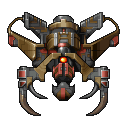

# OpenTyrian

OpenTyrian is an open-source port of the DOS game Tyrian.

Tyrian is an arcade-style vertical scrolling shooter.  The story is set
in 20,031 where you play as Trent Hawkins, a skilled fighter-pilot employed
to fight MicroSol and save the galaxy.

Tyrian features a story mode, one- and two-player arcade modes, and networked
multiplayer.

This is the SDL 1.2 branch of OpenTyrian.  Release builds are made from the
`master` branch, which uses SDL2.

## Configuration

Configuration and saved game files are kept in one of the following locations:

| Platform | Location |
|---|---|
| Windows | `%APPDATA%\OpenTyrian` |
| macOS / Linux | `$XDG_CONFIG_HOME/opentyrian` or `~/.config/opentyrian` |

On Windows and Linux, if `opentyrian.cfg` exists in the same directory as the
executable, the configuration and saved game files will be stored there instead.

## Game Data

Download [Tyrian v2.1](https://camanis.net/tyrian/tyrian21.zip) and
extract the archive so that the files (with lowercase filenames) are in one of
the following locations, searched in order:

1. the directory given with `--data=DIR`
2. a `data` directory next to the executable (Windows and Linux only)
3. the system directory the build was configured with
   (`/usr/local/share/games/tyrian` by default; `C:\TYRIAN` on Windows)
4. the current directory

## Building

Requirements: a C99 compiler, GNU make, pkg-config, SDL 1.2, and, for network
play, SDL_net 1.2.

    make

Network play is enabled automatically when SDL_net is found.

A Visual Studio solution is provided in `visualc/`.

## Command-Line Options

    -h, --help                   Show help about options
    -s, --no-sound               Disable audio
    -j, --no-joystick            Disable joystick/gamepad input
    -x, --no-xmas                Disable Christmas mode
    -t, --data=DIR               Set Tyrian data directory
    -n, --net=HOST[:PORT]        Start a networked game
    --net-player-name=NAME       Set local player name in a networked game
    --net-player-number=NUMBER   Set local player number in a networked game
                                 (1 or 2)
    -p, --net-port=PORT          Set local port to bind (default is 1333)
    -d, --net-delay=FRAMES       Set lag-compensation delay (default is 1)

## Network Multiplayer

Currently OpenTyrian does not have an arena; as such, networked games must be
initiated manually via the command line simultaneously by both players.

    opentyrian --net HOSTNAME --net-player-name NAME --net-player-number NUMBER

where `HOSTNAME` is the IP address of your opponent, `NUMBER` is either 1 or 2
depending on which ship you intend to pilot, and `NAME` is your alias.

OpenTyrian uses UDP port 1333 for multiplayer, but in most cases players will
not need to open any ports because OpenTyrian makes use of UDP hole punching.

## Links

- project: <https://github.com/opentyrian/opentyrian>
- irc:     <ircs://irc.oftc.net/#opentyrian>
- forums:  <https://tyrian2k.proboards.com/board/5>
